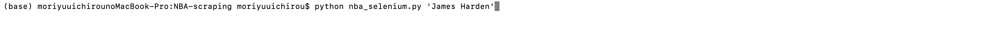

# Search Basketball Player From Basketball Reference(https://www.basketball-reference.com)

## How to search player

ターミナルで該当ソースコードのルートディレクトリに移動し、以下の入力してください

```
python nba_selenium.py 'Player Name'
```


